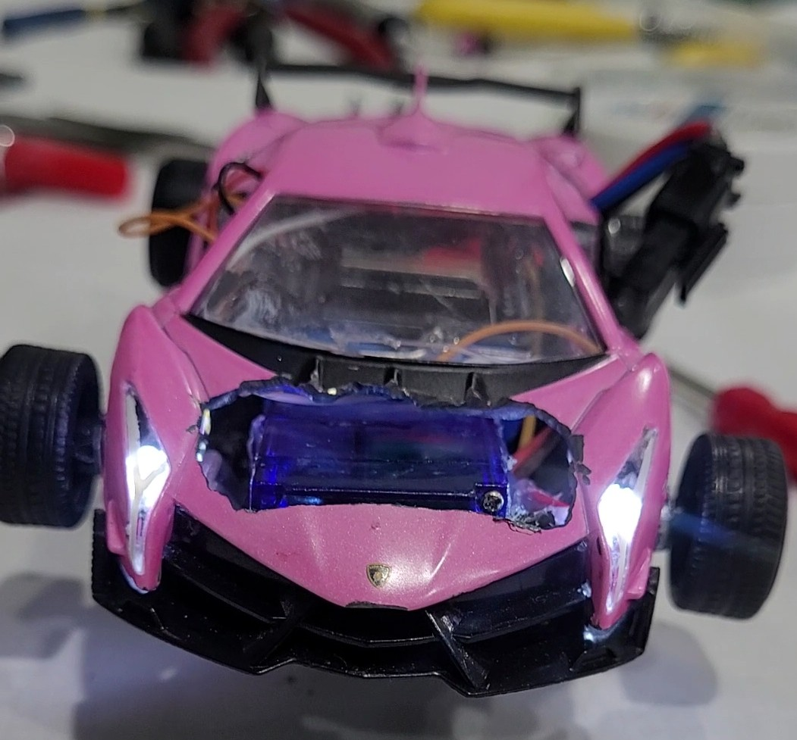
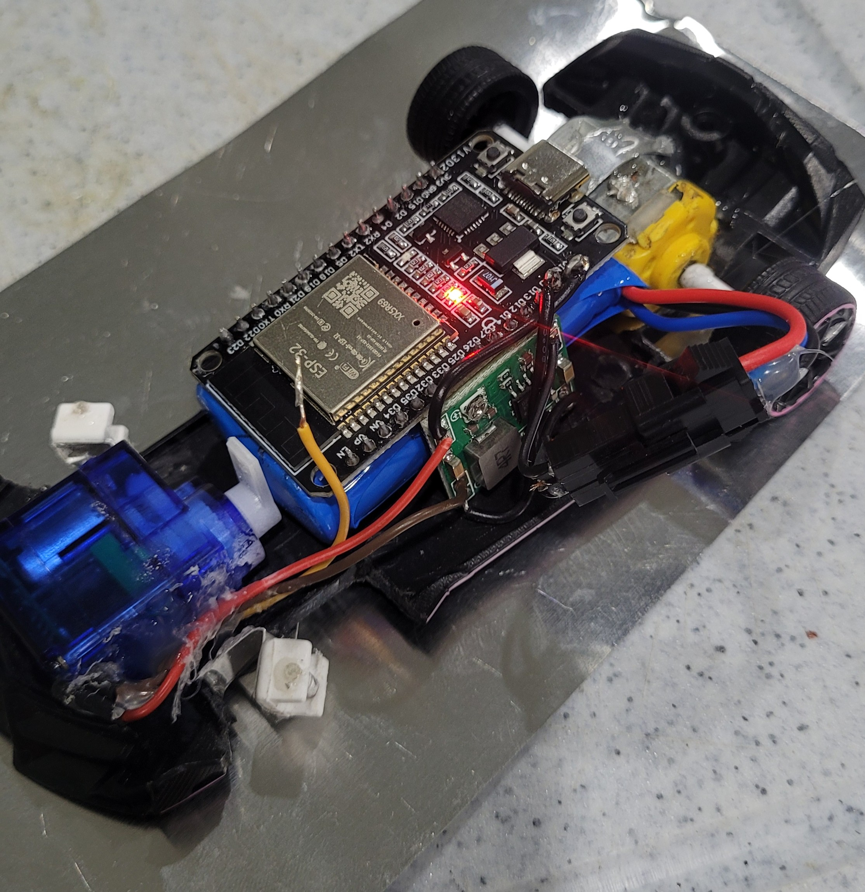
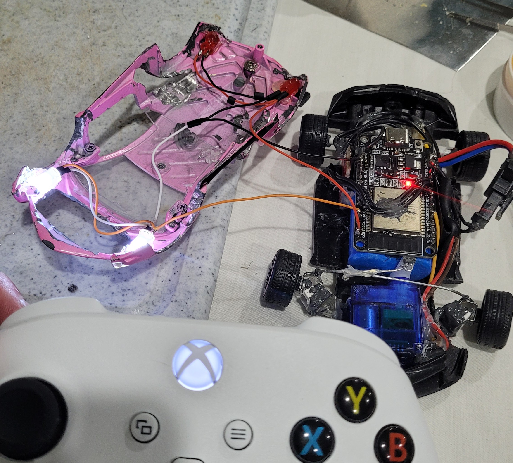

# 1:32 Scale Bluetooth RC Car  
**ESP32-Based Wireless Motor and Steering Control**

## 📌 Overview
This project involved the design and construction of a **1:32 scale remote-controlled (RC) car**, focusing on **electrical integration, microcontroller programming, and compact power management**. The goal was to create a functional system capable of steering and motor control using an **Xbox controller** as a wireless interface.

The final system integrates a DC drive motor, servo-based steering, LED lighting, and Bluetooth communication within the limited spatial constraints of a small-scale chassis.

---

## 🧩 Design and Planning
The project began with **hand-drawn sketches** detailing the car’s internal layout, dimensions, and component placement. This planning stage helped identify spatial constraints and guided mechanical integration decisions.

Early prototypes were developed using an **Arduino Uno** and larger motor drivers to explore motor control fundamentals, including polarity reversal for direction control and pulse-width modulation (PWM) for speed variation. These prototypes served as proof-of-concept builds before transitioning to a more compact final design.

---

## 🧰 Hardware and Components

### Microcontrollers
- Arduino Uno (initial prototyping)
- ESP32 (final build)

### Motor Control
- L298N motor driver (initial testing)
- TB66 motor driver (final build)

### Motors
- DC motor (drive)
- Servo motor (steering)

### Power & Electronics
- Buck converter for voltage regulation
- 7.4v 600mAh Li-ion Battery
- LEDs for headlights and brake lights

### Control Interface
- Xbox controller via Bluetooth connection

The final configuration utilized the ESP32 for its **Bluetooth capability and small footprint**, reducing space usage while maintaining full functionality.

---

## ⚙️ System Integration and Challenges
A primary challenge was designing a **single power system** capable of safely supplying both motors and the microcontroller. Research into motor current draw and voltage requirements led to the use of a **buck converter** to regulate voltage and protect sensitive components.

Capacitors were added to smooth voltage spikes. While flyback protection was initially considered, the chosen buck converter and motor drivers included built-in protection circuitry.

### PWM Interference Limitation
After transitioning to the ESP32, PWM interference became an issue. Under the selected configuration, the board could only output **one stable PWM signal** without crosstalk. To resolve this within budget constraints, control logic was optimized to prioritize **steering and direction control** rather than speed variation.

This limitation ultimately improved understanding of **signal integrity, PWM timing, and microcontroller communication constraints**.

---

## 💻 Programming and Control
All control logic was written in **C++ using the Arduino IDE**.

The firmware handles:
- Servo angle control via PWM for steering
- Direction control of the DC motor through the TB66 driver
- Bluetooth input mapping for Xbox controller joysticks and buttons

Development involved iterative testing and debugging, with emphasis on PWM timing, code efficiency, and reliable microcontroller-to-driver communication.

---

## 🔧 Construction and Assembly
Mechanical integration required drilling and modifying the chassis to securely mount all components. Non-conductive adhesive was used to safely mount electrical hardware, and all soldering was planned in advance to maximize internal space and maintain proper weight distribution.

The final assembly achieved:
- Fully wireless Bluetooth control (~30 ft range)
- Responsive servo-based steering
- Reversible DC motor control
- Integrated headlights and brake lights

---

## 📊 Results and Reflection
The completed RC vehicle successfully demonstrated the integration of **electrical, mechanical, and programming concepts** within a compact form factor. Despite PWM limitations, the system achieved stable power regulation, reliable wireless communication, and full directional control.

This project highlighted the importance of **engineering tradeoffs, iterative design, and adapting solutions to hardware constraints**.

---

## 🧠 Skills and Knowledge Gained
- Microcontroller programming (Arduino & ESP32, C++)
- Circuit design and power management
- Mechanical integration in constrained spaces
- Iterative prototyping and debugging
- Bluetooth communication with external controllers

---

## 🔮 Future Improvements
- Use an ESP32 variant with additional PWM channels for speed control
- Design a custom PCB to reduce wiring complexity
- Integrate a rechargeable Li-ion battery system with power monitoring

---

## 👤 Author
**Vaughn Luce**  
Embedded Systems & Electronics Projects
